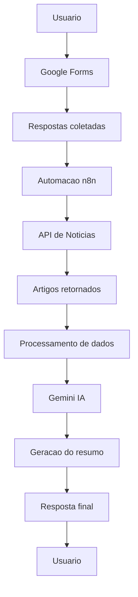

## Sobre o Projeto
Projeto: Resumo de Notícias

Problema que resolve: Facilidade na hora de encontrar e ler as notícias do momento

## Integrantes
| Nome | GitHub |

|------|--------|

| Jhonny Vitor | @jhonnyvsn |

| Miguel Trentini | @MiguelTTortella |

| Geovana Novaes | @geovana-novaes |

## Como funciona

O usuario informa um tema por meio do Google Forms. As respostas sao coletadas e processadas por uma automacao utilizando n8n, que consulta APIs de noticias. Os dados retornados passam por tratamento e sao enviados ao Gemini, que gera um resumo. Por fim, o usuario recebe a resposta processada.

## Arquitetura do sistema

O fluxo abaixo representa o funcionamento da aplicação:

