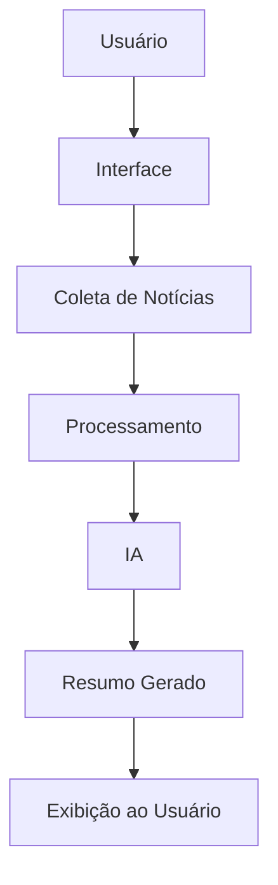

# Resumo de Notícias

## Sobre o Projeto

**Projeto:** Resumo de Notícias

**Problema que resolve:** Facilidade na hora de encontrar e ler as notícias do momento

## Integrantes

| Nome | GitHub |

|------|--------|

| Jhonny Vitor | @jhonnyvsn |

| Miguel Trentini | @MiguelTTortella |

| Geovana Novaes | @geovana-novaes |

## Arquitetura

